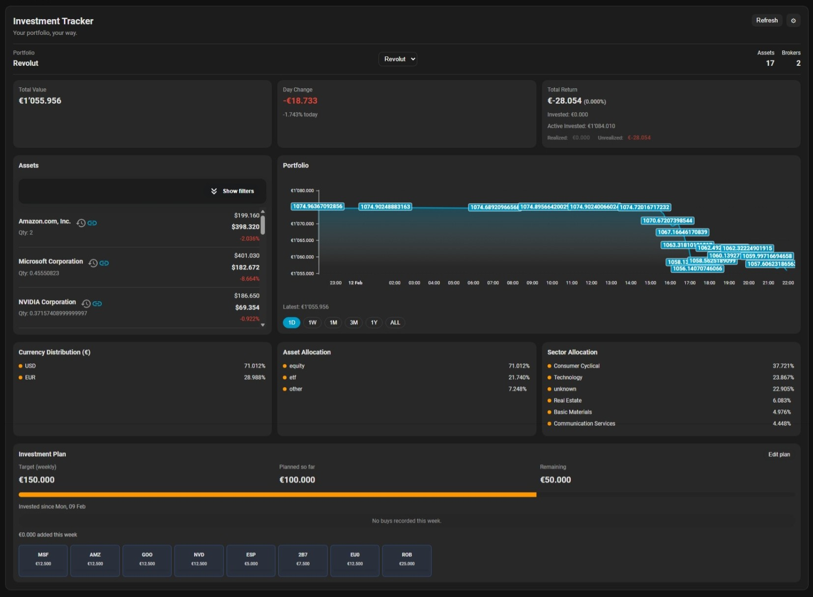

# Investment Tracker Card


A Lovelace dashboard card that mirrors the Home Assistant `investment_tracker` integration, providing summary totals, asset grids, and service controls with plan tracking built in.

## Features
- Header totals surface `total_value`, `total_profit_loss`, and realized/unrealized splits with day-change comparison.
- Asset list renders price, quantity, allocation, profit/loss (absolute and percent), and plan stickiness.
- Built-in plan editor lets you call `investment_tracker.update_plan` to keep recurring investments, targets, and allocations synced with the service sensor.
- Optional refresh controls expose `investment_tracker.refresh` and `investment_tracker.refresh_asset` directly from the card.
- Supports unmapped asset indicators and manual remapping via the integration’s repair helpers.
- Manage the integration right from the card, edit mapping, edit card config, edit plan, filter card, switch portfolio investment service

## Installation (HACS)
1. Install HACS into your Home Assistant instance if you haven’t already.
2. Open HACS → Frontend → Add a new repository.
3. Paste `https://github.com/jo-anb/investment-tracker-card`, choose **Card**, and click **Install**.
4. Reload Lovelace so the new card definition registers, then add `custom:investment-tracker-card` to your dashboard.



## Usage
```yaml
type: custom:investment-tracker-card
title: Investment Tracker
default_service_entity: sensor.investment_tracker_degiro
show_asset_refresh: false
show_header: true
show_positions: true
hide_unmapped: false
show_refresh: true
show_charts: true
show_plan: true
```

### Configuration options
| Option | Type | Description |
| --- | --- | --- |
| `title` | string | Card Title |
| `default_service_entity` | string | Required. The broker slug the service sensor exposes (e.g., `degiro`). |
| `show_header` | bool | Toggles the totals panel at the top of the card. |
| `show_positions` | bool | Displays each asset row, including profit/loss. |
| `hide_unmapped` | bool | Hides assets that remain unmapped to Yahoo Finance. |
| `show_refresh` | bool | Adds the main refresh button that triggers `investment_tracker.refresh`. |
| `show_asset_refresh` | bool | Adds per-asset refresh buttons calling `investment_tracker.refresh_asset` with the asset symbol. |
| `show_plan` | bool | Wether to show the Investment plan section. |
| `show_charts` | bool | Wether to show the Charts section. |


>![NOTE]
>- The card reads from `sensor.investment_tracker_{service}`, `sensor.{broker}_investment_*`, and asset sensors starting with `sensor.{broker}_assets_`.
>- Ensure the integration is configured and reporting balances before adding the card.
>- Call `investment_tracker.remap_symbol` (or use the repair flows) to fix ticker mismatches surfaced by the card.

## Node project
- Run `npm install` and then `npm run build` to produce `dist/investment-tracker-card.js` for distribution.
- `npm run watch` rebuilds automatically while you edit `src/investment-tracker-card.js`.
- `npm run lint` validates the source with ESLint (adjust or expand rules in `.eslintrc.json` if needed).

## Semantic release
- Releases are managed by `semantic-release` (see `.releaserc.json`). Set `GH_TOKEN` in your CI so the tool can publish GitHub releases, update the changelog, and bump `package.json`.
- Call `npm run release` locally only if you have the credentials; CI should run `semantic-release` after tests pass.

## Development
- Source files live in `src/` and are bundled via Rollup – the entry point is `src/investment-tracker-card.js`.
- Update `rollup.config.js` when you need to include additional assets, transpilation steps, or polyfills.
- After building, `dist/investment-tracker-card.js` is the artifact referenced by HACS and Lovelace.

Contributions, bug reports, and ideas welcome via [GitHub issues](https://github.com/jo-anb/investment-tracker-card/issues).
